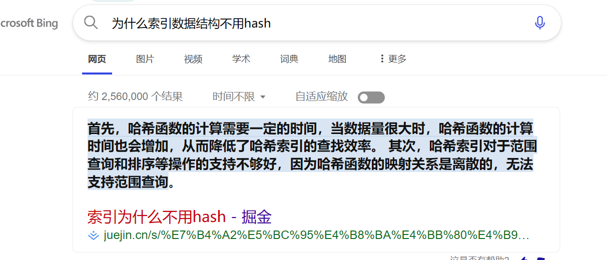
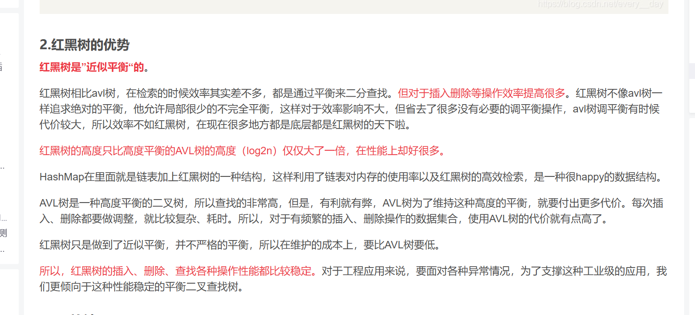
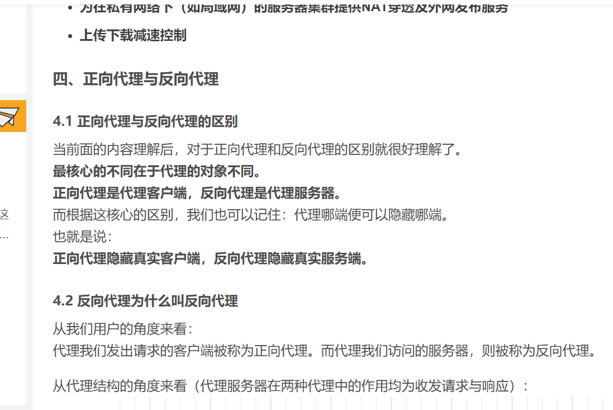

#  1.  为什么MySql索引不使用hash [^ hashMap]



#  2.  为什么hashMap使用红黑树而不是使用AVL树



# 3.  正向代理与反向代理

> 2.3 正向代理的适用场景
> 访问被禁止的资源（让客户端访问原本不能访问的服务器。可能是由于路由的原因，或者策略配置的原因，客户端不能直接访问某些服务器。为了访问这些服务器，可通过代理服务器来访问）
> 突破网络审查
> 再比如客户端IP被服务器封禁，可以绕过IP封禁
> 也可以突破网站的区域限制
> 隐藏客户端的地址（对于被请求的服务器而言，代理服务器代表了客户端，所以在服务器或者网络拓扑上，看不到原始客户端）
> 进行客户访问控制
> 可以集中部署策略，控制客户端的访问行为（访问认证等）
> 记录用户访问记录（上网行为管理）
> 内部资源的控制（公司、教育网等）
> 加速访问资源
> 使用缓冲特性减少网络使用率（代理服务器设置一个较大的缓冲区，当有外界的信息通过时，同时也将其保存到缓冲区中，当其他用户再访问相同的信息时， 则直接由缓冲区中取出信息，传给用户，以提高访问速度。）
> 过滤内容（可以通过代理服务器统一过滤一些危险的指令/统一加密一些内容、防御代理服务器两端的一些攻击性行为）

[(4条消息) 代理、正向代理与反向代理_lgily-1225的博客-CSDN博客](https://blog.csdn.net/qq_43038960/article/details/125591755?ops_request_misc=%257B%2522request%255Fid%2522%253A%2522169017364716782425141474%2522%252C%2522scm%2522%253A%252220140713.130102334.pc%255Fall.%2522%257D&request_id=169017364716782425141474&biz_id=0&utm_medium=distribute.pc_search_result.none-task-blog-2~all~first_rank_ecpm_v1~rank_v31_ecpm-2-125591755-null-null.142^v90^chatsearch,239^v3^insert_chatgpt&utm_term=%E7%BD%91%E7%BB%9C%E4%BB%A3%E7%90%86%E6%AD%A3%E5%90%91%E5%92%8C%E5%8F%8D%E5%90%91%E5%8C%BA%E5%88%AB%EF%BC%9F&spm=1018.2226.3001.4187)



```java
class PeekingIterator implements Iterator<Integer> {
    public PeekingIterator(Iterator<Integer> iterator) {
        // initialize any member here.

    }

    // Returns the next element in the iteration without advancing the iterator.
    public Integer peek() {

    }

    // hasNext() and next() should behave the same as in the Iterator interface.
    // Override them if needed.
    @Override
    public Integer next() {

    }

    @Override
    public boolean hasNext() {

    }
}
```

# 4. hashMap和hashTab的区别

HashMap和HashTable都是Java中用于实现哈希表的数据结构，它们之间存在以下区别：

1. 继承体系：HashMap继承了抽象类AbstractMap，而HashTable继承了抽象类Dictionary（此类已经是一个被废弃的类）。
2. 对Null键和Null值的处理：HashMap支持null键和null值，但这样的键只能有一个，可以有多个键所对应的值为null。而HashTable在遇到null键和null值时会抛出空指针异常。主要是因为在代码中对null值的处理不同。
3. 效率：因为HashTable要保证线性安全，所以比HashMap的效率低。
4. 初始容量大小和每次扩充容量大小：创建时如果不指定容量的初始值，HashMap默认的初始值大小为16，之后每次扩充，容量变为原来的2倍；而HashTable默认的初始值大小为**11**，之后每次扩充，容量变为原来的**2n+1**。如果创建时指定容量的初始值，HashMap会将其扩充为2的幂次方大小，而HashTable会直接使用给定的大小。 

总的来说，HashMap和HashTable各有其特点和适用场景，选择哪一种取决于具体的使用需求。

# 5. 八大排序算法


# 6. java权限控制符


# 7. transient的作用及使用方法

我们都知道一个对象只要实现了Serilizable接口，这个对象就可以被序列化，java的这种序列化模式为开发者提供了很多便利，我们可以不必关系具体序列化的过程，只要这个类实现了Serilizable接口，这个类的所有属性和方法都会自动序列化。

然而在实际开发过程中，我们常常会遇到这样的问题，这个类的有些属性需要序列化，而其他属性不需要被序列化，打个比方，如果一个用户有一些敏感信息（如密码，银行卡号等），为了安全起见，不希望在网络操作（主要涉及到序列化操作，本地序列化缓存也适用）中被传输，这些信息对应的变量就可以加上transient关键字。换句话说，**这个字段的生命周期仅存于调用者的内存中而不会写到磁盘里持久化**。

# 8. 深度和广度的区别


# 9. 十进制转二进制

### 十进制转换为二进制

十进制转二进制分为整数转二进制，和小数转二进制

### 整数转二进制

- 采用"除2取余，逆序排列"法：

> 1.首先用2整除一个十进制整数，得到一个商和余数
> 2.然后再用2去除得到的商，又会得到一个商和余数
> 3.重复操作，一直到商为小于1时为止
> 4.然后将得到的所有余数全部排列起来，再将它反过来（逆序排列），切记一定要反过来！

- 假设我们现在需要将42转为二进制，那我们怎么做呢，如下图所示：

  


# 10. java培训：byte类型127+1等于多少      

byte 类型的取值范围是 -128 到 127，因此 byte 类型的值 127 + 1 的结果是 -128。即 byte 类型的取值范围是有限的，超出范围后会发生溢出，返回到最小值。

byte 是 Java 中的一种基本数据类型，它可以保存一个 8 位的二进制补码值，范围从 -128 到 127。

# 11.部门工资前三高的所有员工

```mysql
select curricula,studentName ,sum(score) over (partition by curricula)
from class;

select curricula,studentName,score,rnk
#dense_rank() 不记录重复
#row_number 记录重复
from (select curricula,studentName,score,row_number()  over (partition by curricula order by score desc) AS rnk
from class) as sub
where rnk <= 3;

select  curricula,studentName,score
from class a
where 3>(select count(distinct b.studentName) from class as b where a.curricula=b.curricula and a.score<b.score)
order by curricula,score desc;
```


---

# 12. Java设计模式及类型

Java设计模式是Java编程语言中常见问题的最佳实践解决方案。这些模式可以帮助开发者创建高效、可重用和可维护的代码。Java设计模式通常分为以下三种大类型：

1. 创建型模式：这些设计模式用于创建对象，同时隐藏对象的创建逻辑。常见的Java创建型模式有工厂方法模式、抽象工厂模式、单例模式、建造者模式和原型模式。
2. 结构型模式：这些设计模式关注类和对象的组合方式，以提供更灵活、更高效的功能。常见的Java结构型模式有适配器模式、装饰器模式、代理模式、外观模式、桥接模式、组合模式和享元模式。
3. 行为型模式：这些设计模式关注对象之间的交互方式和职责分配，以实现更复杂的系统功能。常见的Java行为型模式有策略模式、模板方法模式、观察者模式、迭代器模式、责任链模式、命令模式、备忘录模式、状态模式、访问者模式、中介者模式和解释器模式。


每种Java设计模式都有其特定的应用场景和目的，选择合适的设计模式可以大大提高Java代码的质量和可维护性。同时，了解这些设计模式的原理和应用，也有助于开发者更好地理解和使用Java编程语言。

---

# 13. 脑裂

“脑裂”是指在集群环境中，原本一个“大脑”被拆分了两个或多个“大脑”的情况。具体来说，网络延迟或故障导致集群中不同节点之间的通信中断，使得集群被划分为多个独立的部分，每个部分都独立运行，就像有多个“大脑”一样。这种情况可能导致数据的不一致性和系统的不可用性。

为了避免脑裂的发生，可以采取一些措施，如引入仲裁机制、设置多数派读取和写入等。这些机制可以确保在发生网络分区或故障时，只有一个“大脑”能够继续运行，从而保证数据的一致性和系统的可用性。

---

# 14. finally什么时候不会执行

在Java中，finally块通常在以下情况下不会被执行：

1. 当程序执行过程中遇到System.exit(0)时，finally块将不会执行。因为System.exit(0)会立即终止当前运行的Java虚拟机（JVM），导致finally块无法执行。
2. 当程序执行过程中遇到**Error或RuntimeException**时，finally块将不会执行。这是因为Error和RuntimeException是未检查异常，它们的处理方式与普通异常不同。当遇到这些异常时，JVM会直接终止当前线程，而不会执行finally块。
3. 当程序执行过程中遇到OutOfMemoryError时，finally块可能不会执行。这是因为OutOfMemoryError是一种严重错误，JVM在这种情况下可能会选择不执行finally块，以节省资源。
4. 当程序执行过程中遇到其他未捕获的异常时，finally块可能不会执行。这是因为未捕获的异常会导致JVM终止当前线程，而不会执行finally块。

---

# 15. Java   IO

Java IO是Java编程语言中用于处理输入/输出操作的一组API。它允许Java程序读取和写入数据，与文件、网络套接字等进行交互。

a. 序列化机制：
序列化是指将对象的状态转换为字节流的过程，以便于在网络上传输或将其持久化到存储设备。Java IO提供了对象序列化机制，通过实现Serializable接口，对象的状态可以被转换为字节流并可以进行传输或存储。反序列化则是将字节流转换回对象状态的过程。

b. IO缓冲流与普通的IO流的区别：
Java IO提供了缓冲流（Buffered Stream）和普通流（Unbuffered Stream）两种类型的流。缓冲流在进行输入/输出操作时，会使用内部缓冲区来存储数据，以减少实际的物理输入/输出次数，从而提高输入/输出操作的效率。而普通流则每次进行输入/输出操作时，都会直接对数据进行实际的物理输入/输出操作。因此，缓冲流相较于普通流，可以提供更好的性能。

---

# 16. Java 父类 子类 执行顺序 

Java中静态变量、常量、构造方法的执行顺序如下：

1. 静态变量和常量：静态变量和常量在类加载时就已经分配内存并初始化。它们的初始化顺序与它们在类中的声明顺序一致。首先是静态变量，然后是常量。
2. 构造方法：构造方法是在创建对象时调用的。当使用关键字new创建对象时，会调用相应的构造方法。

对于一个父类和子类的情况，它们的执行顺序如下：


1. 父类静态变量和常量初始化。
2. 子类静态变量和常量初始化。
3. 创建对象时，先调用父类的构造方法，再调用子类的构造方法。

注意，静态变量和常量只在类加载时初始化一次，而构造方法是在每次创建对象时都会被调用。

---

# 17. 索引为什么不方便维护

索引建多了不方便维护的原因主要有以下几个方面：

1. 增加存储空间：每个索引都需要在磁盘上占用一定的存储空间，如果索引过多，会占用大量的磁盘空间，不利于数据的存储和管理。
2. 降低写入性能：当对数据库进行写入操作时，每次写入都需要更新相应的索引，如果索引过多，会增加写入的复杂度和开销，降低写入性能。
3. 增加维护难度：索引需要定期进行维护和优化，以确保其效率和准确性。如果索引过多，会增加维护的难度和工作量，不利于数据库的管理和优化。

---

# 18. ‘A’ 和 ‘a’ 的值


---

# 19. try catch finnally

**try必须有一个catch 或者 finnally配合才不会报错**

---

# 20. 接口

**接口的方法及变量的默认修饰符**
1.接口中每一个方法也是隐式抽象的,接口中的方法会被隐式的指定为 public [abstract](https://so.csdn.net/so/search?q=abstract&spm=1001.2101.3001.7020) （只能是 public abstract，其他修饰符都会报错）。
2.接口中可以含有变量，但是接口中的变量会被隐式的指定为 public [static](https://so.csdn.net/so/search?q=static&spm=1001.2101.3001.7020) final 变量（并且只能是 public，用 private 修饰会报编译错误。）
3.接口中的方法 是不能在接口中实现的，只能由实现接口的类来实现接口中的方法。
**注：**
接口是隐式抽象的，当声明一个接口的时候，不必使用abstract关键字。
接口中每一个方法也是隐式抽象的，声明时同样不需要abstract关键字。
接口中的方法都是公有的。

**接口方法的实现规则**
实现接口的方法，相当于重写方法，方法的重写需要满足：三同一大一小（方法名、返回值类型、参数列表相同；访问权限>=重写前；抛出异常<=重写前）


---

# 21. 重定向 和 转发

**1.forward**

request.getRequestDispatcher("new.jsp").forward(request, response);  //转发到new.jsp

***2.redirect***

response.sendRedirect("new.jsp");  //重定向到new.jsp

很明显一个是用request对象调用，一个是用response对象调用，那么，这两者有什么区别呢？

**一、数据共享方面**

forward:转发页面和转发到的页面可以共享request里面的数据
redirect:不能共享数据

**二、地址栏显示方面**

forward是服务器请求资源,服务器直接访问目标地址的URL,把那个URL的响应内容读取过来,然后把这些内容再发给浏览器.浏览器根本不知道服务器发送的内容从哪里来的,所以它的地址栏还是原来的地址.
redirect是服务端根据逻辑,发送一个状态码,告诉浏览器重新去请求那个地址.所以地址栏显示的是新的URL.

**三、本质区别**


转发是服务器行为，重定向是客户端行为。为什么这样说呢，这就要看两个动作的工作流程： 

转发过程：**客户浏览器发送http请求--->web服务器接受此请求--->调用内部的一个方法在容器内部完成请求处理和转发动作--->将目标资源 发送给客户；在这里，转发的路径必须是同一个web容器下的url，其不能转向到其他的web路径上去，中间传递的是自己的容器内的request。在客 户浏览器路径栏显示的仍然是其第一次访问的路径，也就是说客户是感觉不到服务器做了转发的。转发行为是浏览器只做了一次访问请求。 

**重定向过程：**客户浏览器发送http请求--->web服务器接受后发送**302状态码**响应及对应新的location给客户浏览器--->客户浏览器发现 是302响应，则自动再发送一个新的http请求，请求url是新的location地址--->服务器根据此请求寻找资源并发送给客户。在这里 location可以[重定向](https://so.csdn.net/so/search?q=重定向&spm=1001.2101.3001.7020)到任意URL，既然是浏览器重新发出了请求，则就没有什么request传递的概念了。在客户浏览器路径栏显示的是其重定向的 路径，客户可以观察到地址的变化的。重定向行为是浏览器做了至少两次的访问请求的。 


**重定向，其实是两次request:**第一次，客户端request A,服务器响应，并response回来，告诉浏览器，你应该去B。这个时候IE可以看到地址变了，而且历史的回退按钮也亮了。重定向可以访问自己web应用以外的资源。在重定向的过程中，传输的信息会被丢失。 


---

# 22. 设计模式八大原则

设计模式的八大原则包括：

1. **单一职责原则**（Single Responsibility Principle, SRP）：一个类只应该有一个引起它变化的原因。这意味着一个类应该只有一个职责，只有一个修改的原因。
2. **开放封闭原则**（Open Closed Principle, OCP）：软件实体（类、模块、函数等等）应该可以扩展，但是不可修改。也就是说，新的功能应该通过添加新代码实现，而不是改变现有的代码。
3. **里氏替换原则**（Liskov Substitution Principle, LSP）：子类型必须能够替换它们的基类型。也就是说，我们使用一个基类的指针或引用调用派生类的方法，不应该引发任何异常或错误。
4. **接口隔离原则**（Interface Segregation Principle, ISP）：客户端不应该依赖它们不需要的接口。这意味着我们应当尽量将接口拆分得更细，避免强迫客户端依赖它们不需要的方法。
5. **依赖倒置原则**（Dependency Inversion Principle, DIP）：要依赖于抽象，不要依赖于具体。实现类之间的依赖通过抽象（接口或抽象类）进行，避免类之间的直接耦合。
6. **优先使用对象组合而非类继承**：因为继承会增加代码之间的耦合性，而组合则能够使代码更加灵活和可复用。
7. **封装变化点**：使用封装来创建对象之间的分界层，让设计者可以在分界的一侧进行修改，而不会对另一侧产生不良的影响，从而实现层次间的松耦合。
8. **针对接口编程，而不是针对实现编程**：这意味着我们在编程时，应当尽量使用接口，而不是具体的实现类。这样可以使得代码更加灵活，易于维护和扩展。

以上八大原则为设计模式的基本原则，遵循这些原则可以使代码设计更合理、可维护性更高、可扩展性更强。

---

# 23. final 的小细节

* final 可以用在main函数里面
* final 必须初始化否者编译错误

---

# 24. Java应用程序日志一般记录什么内容


Java应用程序的日志记录内容可以根据应用程序的需求和特定场景进行调整，但通常建议包含以下几类信息：

1. **错误和异常信息：** 记录应用程序发生的错误和异常情况，包括异常堆栈信息，以便开发人员能够追踪和调试问题。
2. **警告信息：** 记录一些可能会影响应用程序正常运行但并不致命的警告信息，帮助开发人员在早期发现并解决潜在问题。
3. **信息性日志：** 记录应用程序的关键运行时信息，用于追踪应用程序的执行流程和状态，以及性能相关的信息。
4. **调试信息：** 在开发和测试阶段，可以记录详细的调试信息，帮助开发人员定位和解决问题。在生产环境中，可以选择关闭或限制调试信息的记录，以避免过多的日志数据。
5. **运行时环境信息：** 记录与应用程序运行环境相关的信息，例如操作系统版本、Java虚拟机版本、硬件信息等，有助于排查与环境相关的问题。
6. **业务日志：** 如果应用程序涉及特定业务逻辑，可以记录与业务相关的信息，用于监控和分析业务运行状况。
7. **用户操作日志：** 记录用户在应用程序中的操作，以便在需要时能够重现用户的操作流程，有助于解决用户反馈的问题。

---

# 25. 全双工 半双工通信

半双工通信和全双工通信是通信领域的两种不同的工作模式，它们主要区别在于数据传输的方向和时间上的分配。

**半双工通信**： 在半双工通信模式下，通信双方轮流使用同一信道进行发送和接收。这意味着在任何给定的时间点，信道只能单向传输数据。当一方正在发送数据时，另一方必须等待，不能同时发送。这种模式类似于对讲机，一方说话时，另一方必须等待对方结束才能说话。

**全双工通信**： 全双工通信则允许通信双方同时在两个方向上传输数据。这意味着双方可以同时发送和接收信息，就像电话通话一样，双方可以同时说话和听对方说话。全双工模式需要两个独立的信道，一个用于发送，另一个用于接收。

简而言之，半双工通信是**双向**的，但不是**同时**的；而**全双工通信是同时双向的**。在实际应用中，选择哪种通信模式取决于具体的应用需求和资源配置。例如，电话系统通常采用全双工模式，因为它需要实时双向通信；而对讲机通常使用半双工模式，因为它在同一时间点只能支持一方发送。

---

# 26. 重载和重写有什么区别？

重载就是同样的一个方法能够根据输入数据的不同，做出不同的处理

重写就是当子类继承自父类的相同方法，输入数据一样，但要做出有别于父类的响应时，你就要覆盖父类方法

---

# 27. 无用的类

-  该类所有的实例都已经被回收，也就是 Java 堆中不存在该类的任何实例。
-  加载该类的 `ClassLoader` 已经被回收。
-  该类对应的 `java.lang.Class` 对象没有在任何地方被引用，无法在任何地方通过反射访问该类的方法。

---

# 28. 红黑树

红黑树是一种自平衡的二叉查找树，它在每个节点上增加了一个存储位来表示节点的颜色，可以是RED或BLACK。通过对任何一条从根到叶子的路径上各个节点的颜色进行约束，红黑树确保没有一条路径会比其他路径长出两倍，因而是近似平衡的。
红黑树具有以下特性：
1. **节点颜色**：每个节点非红即黑。

2. **根节点**：根节点是黑色的。

3. **红色规则**：如果一个节点是红色的，则它的两个子节点都是黑色的（不能有两个连续的红色节点）。

4. **黑色高度**：从任一节点到其每个叶子的所有路径都包含相同数目的黑色节点。

5. **新插入节点**：新插入的节点为红色。

这些特性共同保证了红黑树的高度大致是对数级的，从而保证了红黑树的基本操作（查找、插入、删除）的时间复杂度为O(log n)。
在维护红黑树的平衡性时，可能会进行以下操作：
- **变色**：改变某个节点的颜色。
- **旋转**：改变树的结构，分为左旋和右旋两种。

红黑树广泛应用于各种库和框架中，如Java的TreeMap、TreeSet，C++ STL的map、set等，以提供高效的键值对存储和查询功能。

---

# 29. Maven 依赖范围

**classpath** 用于指定 `.class` 文件存放的位置，类加载器会从该路径中加载所需的 `.class` 文件到内存中。

Maven 在编译、执行测试、实际运行有着三套不同的 classpath：

-  **编译 classpath**：编译主代码有效
-  **测试 classpath**：编译、运行测试代码有效
-  **运行 classpath**：项目运行时有效

Maven 的依赖范围如下：

-  **compile**：编译依赖范围（默认），使用此依赖范围对于编译、测试、运行三种都有效，即在编译、测试和运行的时候都要使用该依赖 Jar 包。
-  **test**：测试依赖范围，从字面意思就可以知道此依赖范围只能用于测试，而在编译和运行项目时无法使用此类依赖，典型的是 JUnit，它只用于编译测试代码和运行测试代码的时候才需要。
-  **provided**：此依赖范围，对于编译和测试有效，而对运行时无效。比如 `servlet-api.jar` 在 Tomcat 中已经提供了，我们只需要的是编译期提供而已。
-  **runtime**：运行时依赖范围，对于测试和运行有效，但是在编译主代码时无效，典型的就是 JDBC 驱动实现。
-  **system**：系统依赖范围，使用 system 范围的依赖时必须通过 systemPath 元素显示地指定依赖文件的路径，不依赖 Maven 仓库解析，所以可能会造成建构的不可移植。

---

# 30. Docker 的好处

-  Docker 的镜像提供了除内核外完整的运行时环境，确保了应用运行环境一致性，从而不会再出现 “这段代码在我机器上没问题啊” 这类问题；——一致的运行环境
-  可以做到秒级、甚至毫秒级的启动时间。大大的节约了开发、测试、部署的时间。——更快速的启动时间
-  避免公用的服务器，资源会容易受到其他用户的影响。——隔离性
-  善于处理集中爆发的服务器使用压力；——弹性伸缩，快速扩展
-  可以很轻易的将在一个平台上运行的应用，迁移到另一个平台上，而不用担心运行环境的变化导致应用无法正常运行的情况。——迁移方便
-  使用 Docker 可以通过定制应用镜像来实现持续集成、持续交付、部署。——持续交付和部署

---

# 31. 用户态 内核态 上下文切换

## 用户态与内核态

用户态（User Mode）是程序执行时的一种状态，在这个状态下，程序只能访问有限的资源，例如程序自己的内存空间等。而内核态（Kernel Mode）是操作系统内核所运行的模式，可以无限制地访问所有资源。

## 上下文切换

上下文切换（Context Switch）是操作系统在多任务处理中用来在多个进程或线程之间切换的一种机制。当一个任务（如进程或线程）被剥夺运行权，而另一个任务被赋予运行权时，就会发生上下文切换。上下文切换包括保存当前任务的状态，恢复即将运行的任务的状态，并更新各种内核数据结构以反映新的任务正在运行。

---

# 32. 延时双删 先写数据库再改缓存

在Java编程中，处理MySQL等关系型数据库与Redis缓存之间数据一致性的问题时，`延时双删`和`先更新数据库再删除缓存`这两种策略的目的都是为了减少数据不一致的可能性，但它们各有适用场景，并不存在绝对意义上的“哪个更好”，而是根据具体业务场景选择更合适的方案。

1. **先更新数据库再删除缓存**：
   - 这种方式直接确保了数据库中的数据是最新的，然后删除缓存使得后续的读请求重新从数据库加载最新数据。它的优点在于逻辑相对简单，容易实现。缺点是在删除缓存与新数据被写回缓存之间的窗口期内，如果发生大量读请求，可能会对数据库造成较大压力，同时存在短时间内读取到旧数据（缓存穿透）的风险。

2. **延时双删策略**：
   - 在这种方式下，首先也会删除缓存以避免继续提供旧数据，接着更新数据库，最后在一定延时后再次删除缓存。第二次删除是为了应对可能出现的并发问题：
     - 若先删除缓存后更新数据库，有可能在更新数据库期间，有新的请求未命中缓存，将旧数据库数据写回到缓存中。
     - 延时双删尝试通过增加一个延时后的第二次删除来确保在这段延时内所有基于旧数据的缓存写入都被清理掉。

   - 延时双删的优点在于它能进一步降低数据不一致的概率，特别是在并发场景下。然而，这种方法引入了额外的复杂度，并且依赖于预设的合理延时值，过短可能导致并发问题未完全解决，过长则影响效率。

综上所述，对于对数据一致性要求极高并且可以容忍一定程度性能损失的场景，可能倾向于采用更为复杂的延时双删策略；而对于大部分普通场景或者对性能敏感的场景，只要并发控制得当，先更新数据库再删除缓存可能是较为实际的选择。当然，在某些极端场景如秒杀活动等高并发场景下，可能需要采用事务、分布式锁或者其他更高级的一致性保证手段。

---

# 33. Collection.sort()底层原理

事实上Collections.sort方法底层就是调用的Arrays.sort方法，而Arrays.sort使用了两种排序方法，快速排序和优化的[归并排序](https://so.csdn.net/so/search?q=归并排序&spm=1001.2101.3001.7020)。

快速排序主要是对那些基本类型数据（int,short,long等）排序， 而归并排序用于对[Object类](https://so.csdn.net/so/search?q=Object类&spm=1001.2101.3001.7020)型进行排序。
使用不同类型的排序算法主要是由于快速排序是不稳定的，而归并排序是稳定的。这里的稳定是指比较相等的数据在排序之后仍然按照排序之前的前后顺序排列。对于基本数据类型，稳定性没有意义，而对于Object类型，稳定性是比较重要的，因为对象相等的判断可能只是判断关键属性，最好保持相等对象的非关键属性的顺序与排序前一致；另外一个原因是由于归并排序相对而言比较次数比快速排序少，移动（对象引用的移动）次数比快速排序多，而对于对象来说，比较一般比移动耗时。
       此外，对大数组排序。快速排序的sort()采用递归实现，数组规模太大时会发生堆栈溢出，而归并排序sort()采用非递归实现，不存在此问题。

## 总结

首先先判断需要排序的数据量是否大于60。

小于60：使用插入排序，插入排序是稳定的

大于60的数据量会根据数据类型选择排序方式：

*  基本类型：使用快速排序。因为基本类型。1、2都是指向同一个常量池不需要考虑稳定性。
*  Object类型：使用归并排序。因为归并排序具有稳定性。
注意：不管是快速排序还是归并排序。在二分的时候小于60的数据量依旧会使用插入排序

---

# 32. StringBuilder 建造者设计模式

在复习设计模式的时候，了解到StringBuilder使用了[建造者模式](https://so.csdn.net/so/search?q=建造者模式&spm=1001.2101.3001.7020)，在此记录一下。


首先我们要了解建造者模式的构成。


建立一个建造者模式的小栗子。

我们建造一个属性为Person的产品，同时创建Man 和Women.

1.创建接口PersonBuilder，其中包含需要创建的 head body foot  即 Builder

2.创建实现类WomenBuilder和ManBuilder来实现PersonBuilder接口中的方法，即 ConcreteBuilder

3.创建PersonDirector 来指定你要创建的是Women还是Man,即Director

4.由于最后生成的产品是Person，所以我们要创建实体类Person,

5.同时我们可以创建普通类Man和Women,来继承Person, 增强拓展性，方便PersonDirector进行管理。

---

# 33. Integer 缓存对象

在Java中，整数值在一定范围内（-128到127，包括两端）的自动装箱结果会被缓存，以提高性能。这意味着，当我们使用`Integer.valueOf(int)`方法创建整数对象时，如果值在此范围内，**会返回缓存中的对象，而不是每次都创建新的对象**。

---

# 34. Docker file 和 Docker Compose的区别

DockerFile和Docker Compose是Docker生态系统中两个非常重要的工具，它们在容器化应用的创建和管理中扮演着不同的角色：

1. **DockerFile**：
   - **定义镜像**：DockerFile是一个文本文件，它包含了一系列的指令和参数，这些指令被用来自动化构建Docker镜像的过程。
   - **单文件**：一个DockerFile通常对应一个镜像，它定义了如何从基础镜像开始，添加应用、依赖、配置等，构建出最终的镜像。
   - **构建命令**：使用`docker build`命令来根据DockerFile构建镜像。
   - **用途**：主要用于定义镜像内容，包括操作系统、应用、库、环境变量等。

2. **Docker Compose**：
   - **定义多容器应用**：Docker Compose是一个用于定义和运行多容器Docker应用程序的工具。它使用YAML文件来配置应用程序的服务，通过一个单一的命令，就可以创建并启动所有服务。
   - **多文件**：Docker Compose通常使用`docker-compose.yml`文件来定义服务，每个服务可以是一个Docker容器，并且可以指定不同的镜像、网络、卷等。
   - **启动命令**：使用`docker-compose up`命令来启动定义在`docker-compose.yml`文件中的所有服务。
   - **用途**：主要用于定义和管理多容器Docker应用程序的部署，使得开发、测试、部署变得简单快捷。

简单来说，DockerFile用于创建镜像，而Docker Compose用于定义和管理由多个容器组成的应用程序。Docker Compose可以利用DockerFile构建的镜像来启动容器，并且可以轻松地管理这些容器的生命周期。

---

# 35. JS特殊语法 ‘-’

Js中不支持 属性 -语法，不然会报错，修改：用引号引起来，back-ground ->‘ back-ground’

---


